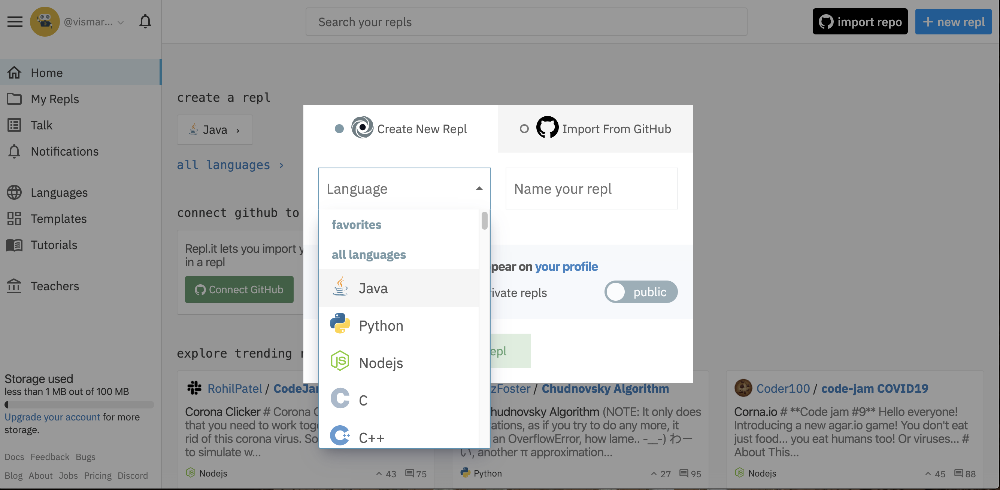
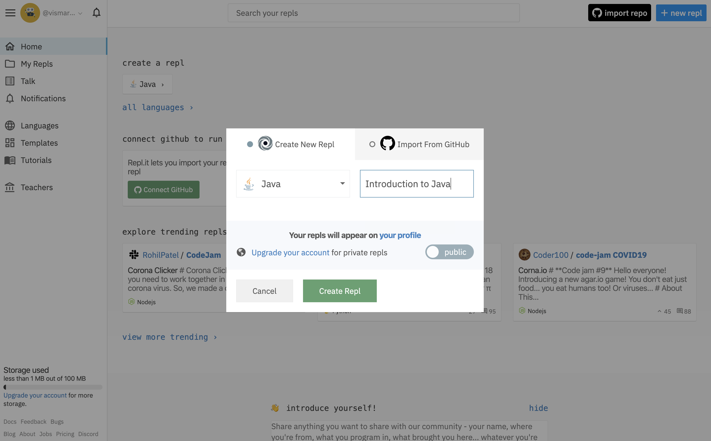
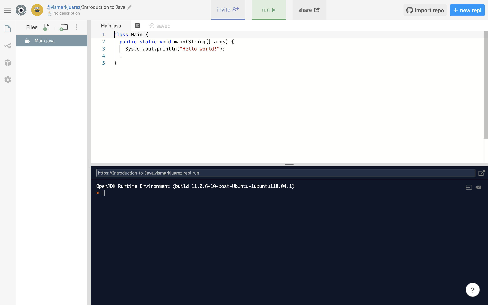
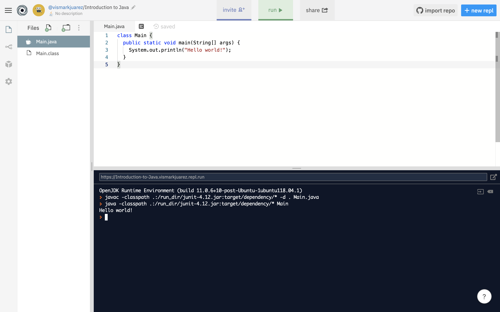

This document will cover how to create a new Java project on `Repl.it`, a website where you can write and run code (in any programming language).


## Create a new Java Project on Repl.it:

1. To begin writing a new Java program, go to the following website: `https://repl.it` and create a free account.  After you create your free account, clicking on the "Home" tab on the laft-hand column will show you a dashboard that looks something like this:


2. Now you're ready to start a new Java project. To create a new Java project, click on the blue `+ new repl` button on the top right-hand corner of your "Home" dashboard page. Once you click on the blue button, you'll see the following dialog box:



The dialog box will show you a drop-down list, `Language`, where you'll need to specify what programming language you want to write your new project in.  We'll be using Java, so click on `Java` in the list of languages.

Next to the `Language` selection drop-down, Repl is asking for a project name (`Name your repl`).  You can name it anything you want. For this demo, it will be named `Introduction to Java`.

Once you selected the programming language and named your project, the dialog will look something like this:



Finally, click on the green `Create Repl` button on the bottom of the dialog box to create your project.

3. After clicking on the `Create Repl` button, you will be re-directed to your "project workspace".  Your project workspace is where you will be able to write and run your Java code. In Java, you will need some default code to be able to run your project.  For now, don't worry about what this default code (a.k.a "boiler-plate" code) is doing, it will be explained in later sections. For now, your project should look something like this:



4. Lastly, click on the green `Run` button on the top of your workspace.  This will run the code in your project file.  Right now, you should only have one file called `Main.java` that contains code that was automatically generated when you created the project. The only thing this "boiler-plate" code does is print out the message `Hello, World`. This will be explained in section 2.

Clicking on the green `Run` button should show the following messages in your "console window" (this is the blue area you see at the bottom of your workspace screen):

```bash
OpenJDK Runtime Environment (build 11.0.6+10-post-Ubuntu-1ubuntu118.04.1)
> javac -classpath .:/run_dir/junit-4.12.jar:target/dependency/* -d . Main.java
> java -classpath .:/run_dir/junit-4.12.jar:target/dependency/* Main
Hello world!
```

Your workspace console window should look like this:



You're now ready to move on to section 2 (`2. Project Structure & System.out.println()`), which explains what all of the automatically-generated "boiler plate" code is doing, along with the `System.out.println()` command.
