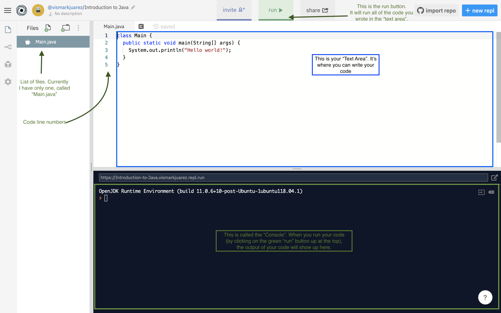
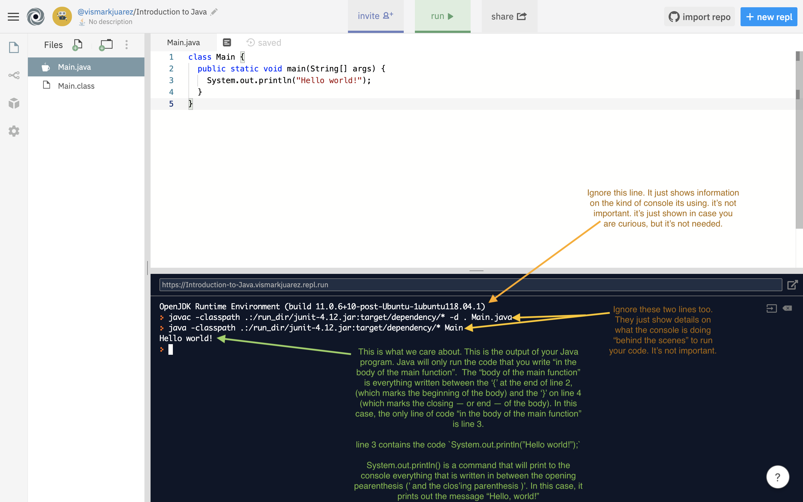
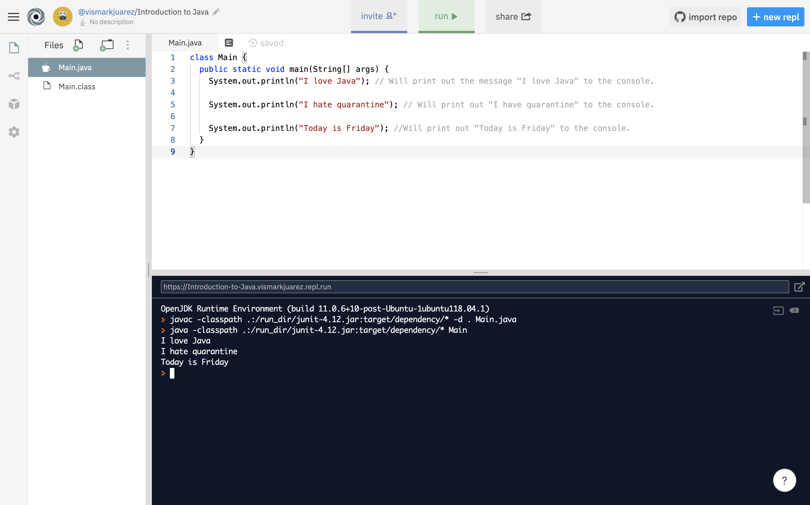

In section 1, you created a new Java project on the Repl website. When you created it, a few lines of Java code were automatically generated for you. This section explains what those lines of Java code are and why they are needed in every Java project you will ever write.  This section also covers the `System.out.println()` command (used to print out messages to the console).

## Java Project "Boilerplate Code":

1. When you created your new project, a few lines of code were automatically created for you, they should be something like this:

```java
class Main {
  public static void main(String[] args) {
    System.out.println("Hello world!");
  }
}
```

This is called the "Main class".  And inside the `Main` class, you have a function that's called `main` (notice the lower-case 'm'). You don't need to understand what a `class` is. You also don't need to understand that the `main` function is. you don't even need to understand what these are for right now.  All you need to know is that every Java project has a class called `Main` and a function "inside" of the class called `main`.  Simply ignore them for now.  We want to focus on learning Java.  Classes and functions will be covered in later sections.

## Printing data to the console using `System.out.println()`

1. When you created a new project, you will be given a new workspace containing a `Text Area`, a `Console` and a single `Main.java` file. Below is a picture with a brief explanation of the different parts of the workspace:



2. Click on the green `Run` button. This will "run" (a.k.a "execute") all of the code within the "body" of the `main` function. In this case the "body of the `main` function" is only one line -- line 3 which contains the following code:

```java
System.out.println("Hello world!");
```

In Java, `System.out.println()` is how you print data to the console. Everything you type in between the `( )` will be displayed in the console. This means that, if you run the code in your text area, you should have a message show up in your console saying "Hello world!", like this:



3. Let's take a look at the `System.out.println()` command. There are a few important things to always keep in mind.

- The `S` in `System.out.println()` is CAPITALIZED!
- Don't forget the semi-colon at the end!
- If you want to print out a message, always wrap your message inside of double quotes (`""`). You can write anything you want to output in the System.out.println() command, just be sure you wrap your message in double quotes, for example:


```java
class Main {
  public static void main(String[] args) {
    System.out.println("I love Java"); // Will print out the message "I love Java" to the console.

    System.out.println("I hate quarantine"); // Will print out "I have quarantine" to the console.

    System.out.println("Today is Friday"); //Will print out "Today is Friday" to the console.
  }
}
```


Running the code above will output the following:



Notice how the print statements are all output in order, from top to bottom. Java will always run your code, one line at a time.

If we re-arrange the order of the print statements, the order of the output will always match it. for example:


```java
class Main {
  public static void main(String[] args) {

    System.out.println("I hate quarantine"); // Will print out "I have quarantine" to the console.

    System.out.println("I love Java"); // Will print out the message "I love Java" to the console.

    System.out.println("Today is Friday"); //Will print out "Today is Friday" to the console.
  }
}
```

Outputs the print statements in the order that they were written:


4. Play around with print statements yourself. Make new print statements and have them print any message you want (there's no length limit!). Once you're ready move on to section 3 to begin learning about datatypes in Java.
