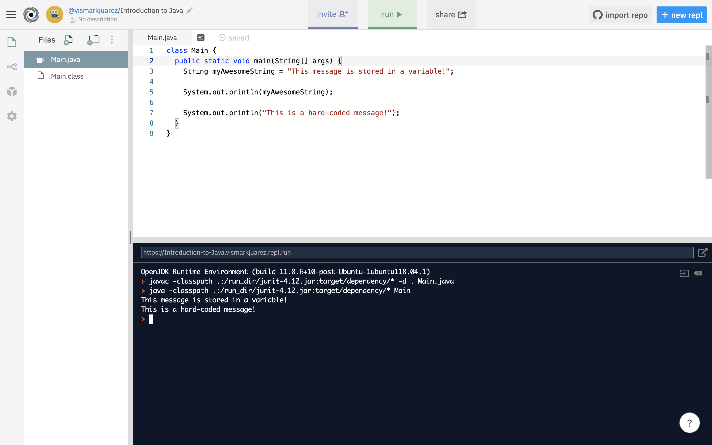

This section will cover the `String` datatype; a Java "datatype" that holds data in the form of a string of alphabet characters.


## Java `String`
 In Java there exist a series of "datatypes" that are used to store data.
 One of these "datatypes" is called the  `String` datatype.  A string helps
 you save a pice of information (a string of alphabet characters) as a "variable".
 A variable is given a name, and then you can retrieve the information you saved
 in that `String` variable later.

 For example:

 ```Java

 //creating a String variable, naming it 'myAwesomeString' and assigning it the value (using the '=') to "This message is stored in a variable!"
 String myAwesomeString = "This message is stored in a variable!";

//printing out the message using the `String` variable (make sure the variable you want to print out is spelled EXACTLY how you defined it. Capitalization and spelling are very important in programming)
 System.out.println(myAwesomeString);

 //printing out a message the sloppy way (hard-coding it)
 System.out.println("This is a hard-coded message!");

 ```

 Running the code above will print two messages. The
 first message ("This message is stored in a variable!") comes from the data stored in
 a String variable.  The second message is "This is a hard-coded message!", and it
 was hard-coded into the print statement.

To follow along, your code and output after running it should look like this:



Why do we care about storing messages (strings) into a `String` variable? Look at the following example, where we have 
